# myTIMeS Backend — Complete Project Flow

> This document explains **how every part of the system works**, why you got a 401 on register, and the exact order of operations to use the API from scratch.

---

## Table of Contents

1. [Why Register Returns 401](#1-why-register-returns-401--the-bootstrap-problem)
2. [Getting Started — Step by Step](#2-getting-started--step-by-step)
3. [Authentication Flow](#3-authentication-flow)
4. [User & Role System](#4-user--role-system)
5. [Class Management Flow](#5-class-management-flow)
6. [Student Enrollment Flow](#6-student-enrollment-flow)
7. [Session Lifecycle](#7-session-lifecycle--the-core-of-attendance)
8. [Attendance Calculation Engine](#8-attendance-calculation-engine)
9. [Excuse / Waiver Workflow](#9-excuse--waiver-workflow)
10. [Notifications System](#10-notifications-system)
11. [Complete Request Lifecycle](#11-complete-request-lifecycle)
12. [Entity Relationship Overview](#12-entity-relationship-overview)

---

## 1. Why Register Returns 401 — The Bootstrap Problem

You got this error:

```json
{
    "error": "Authorization token is missing",
    "status": 401
}
```

**This is expected behavior.** Here's why:

The `POST /api/auth/register` endpoint is decorated with `@require_role("admin")`. This means **only an already-authenticated admin can create new users**. This is a security design — you don't want random people registering accounts in an attendance system.

But when you first start the app, the database is empty. There are no users at all, so there's no admin to log in as, and no way to create one through the API.

> [!IMPORTANT]
> **The Solution:** Run the seed script to create your first admin user directly in the database:
> ```bash
> python seed_admin.py
> ```
> This creates an admin with `admin@mytimes.com` / `admin123`. Then you log in through the API to get a JWT token, and use that token to register everyone else.

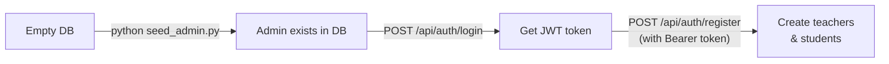

---

## 2. Getting Started — Step by Step

Here's the exact sequence to go from zero to a working system:

### Step 1: Start the server
```bash
cd backend
pip install -r requirements.txt
cp .env.example .env          # edit SECRET_KEY for production
python app.py                 # or: flask run
```
> On first run, SQLite creates `instance/attendance.db` with all tables automatically.

### Step 2: Seed the first admin
```bash
python seed_admin.py
```
Output:
```
==================================================
  ADMIN USER CREATED SUCCESSFULLY
==================================================
  User ID  : 1
  Email    : admin@mytimes.com
  Password : admin123
  Role     : admin
==================================================
```

### Step 3: Login as admin → get JWT token
```
POST /api/auth/login
Body: { "email": "admin@mytimes.com", "password": "admin123" }
```
Response:
```json
{ "token": "eyJhbG...", "role": "admin", "user_id": 1, "fullname": "System Admin" }
```
> **Copy this token.** You'll use it in the `Authorization` header for all subsequent requests.

### Step 4: Register a teacher
```
POST /api/auth/register
Headers: Authorization: Bearer <admin-token>
Body: {
  "fullname": "Dr. Ramesh Sharma",
  "email": "ramesh@mytimes.com", 
  "password": "teacher123",
  "role": "teacher"
}
```

### Step 5: Register students
```
POST /api/auth/register
Headers: Authorization: Bearer <admin-token>
Body: {
  "fullname": "Anita Thapa",
  "email": "anita@mytimes.com",
  "password": "student123",
  "role": "student",
  "roll_number": "BCA-2024-001",
  "program": "BCA",
  "year_of_study": 2
}
```

### Step 6: Create a class
```
POST /api/admin/class/create
Headers: Authorization: Bearer <admin-token>
Body: {
  "class_name": "Data Structures",
  "subject": "Computer Science",
  "room": "Lab-301",
  "teacher_id": 2,
  "duration_minutes": 60
}
```

### Step 7: Enrol students in the class
```
PUT /api/student/enrol/1
Headers: Authorization: Bearer <admin-token>
Body: { "class_id": 1 }
```

### Step 8: Teacher starts a session
```
POST /api/session/start
Headers: Authorization: Bearer <teacher-token>
Body: { "class_id": 1, "mode": "Strict" }
```

### Step 9: Teacher ends the session
```
POST /api/session/end
Headers: Authorization: Bearer <teacher-token>
Body: { "session_id": "<uuid-from-step-8>" }
```

Now the system is fully operational. Students can view their attendance, submit excuses, etc.

---

## 3. Authentication Flow

Every API request (except login) follows this flow:

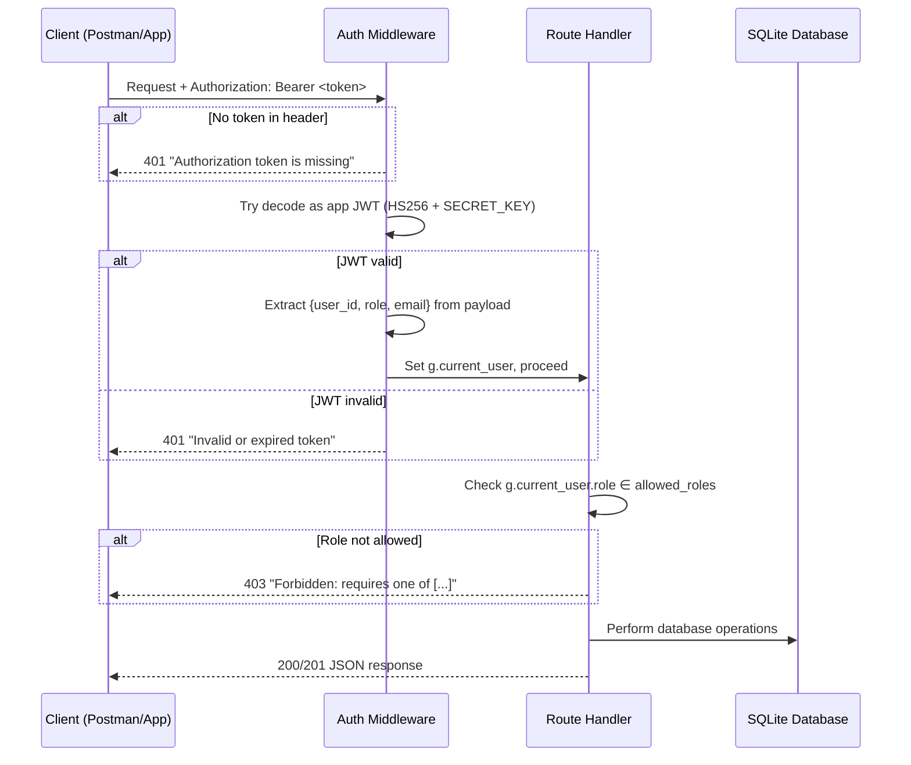

### How JWT Works in This System

1. **Login** → server generates a JWT with payload `{user_id, role, email, exp}` signed with `SECRET_KEY`
2. **Token lifetime** → 24 hours (configurable via `JWT_EXPIRY_HOURS`)
3. **Every request** → client sends `Authorization: Bearer <token>` header
4. **Middleware decodes** → extracts user info into `g.current_user`
5. **Role check** → `@require_role("admin")` compares `g.current_user.role` against allowed roles

### JWT Payload Structure
```json
{
  "user_id": 1,
  "role": "admin",
  "email": "admin@mytimes.com",
  "exp": 1748186400
}
```

---

## 4. User & Role System

The system has three roles with strict permission boundaries:

| Role | Can Do | Cannot Do |
|------|--------|-----------|
| **admin** | Everything — register users, manage classes, approve excuses, override attendance, delete data | N/A |
| **teacher** | Start/end sessions for their own classes, view reports, view students | Register users, manage classes, approve excuses, delete students |
| **student** | View own attendance, submit excuses, view own notifications | View other students' data, start sessions, approve anything |

### Registration creates different records based on role:

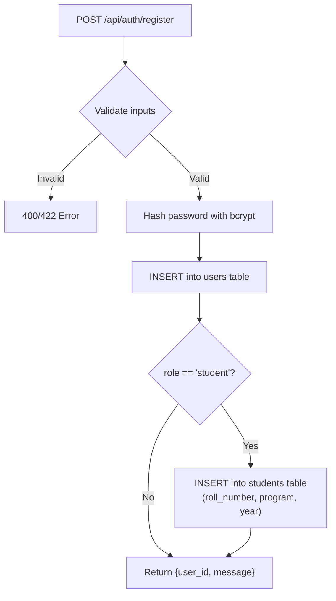

> [!NOTE]
> When role is `student`, the request body **must** include `roll_number` and `program` — these go into the separate `students` table linked to the `users` table via `user_id`.

---

## 5. Class Management Flow

Classes are the organizational unit — they link teachers to subjects and rooms.

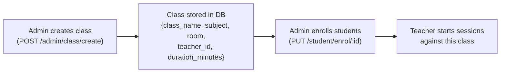

**Key rules:**
- A class has **one teacher** (`teacher_id` → `users.id`)
- A class has **many enrolled students** (via `enrollments` table)
- A class can have **many sessions** over time
- A class **cannot be deleted** if it has active sessions

---

## 6. Student Enrollment Flow

Enrollment connects students to classes. Without enrollment, students don't appear in attendance when a session starts.

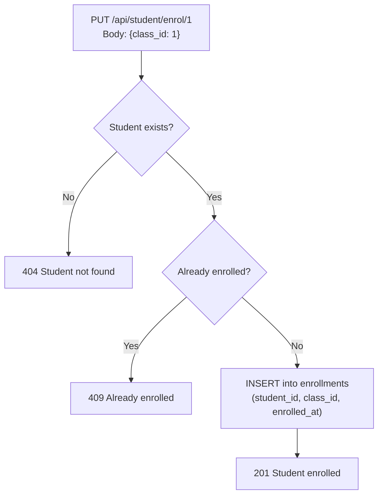

**Why enrollment matters:** When a teacher starts a session for a class, the system automatically creates `attendance_records` rows for **every enrolled student** with `status=Absent` as the default. If a student isn't enrolled, they won't get an attendance record for that session.

---

## 7. Session Lifecycle — The Core of Attendance

A session represents one class period where attendance is tracked. This is the most important flow in the system.

### 7.1 Starting a Session

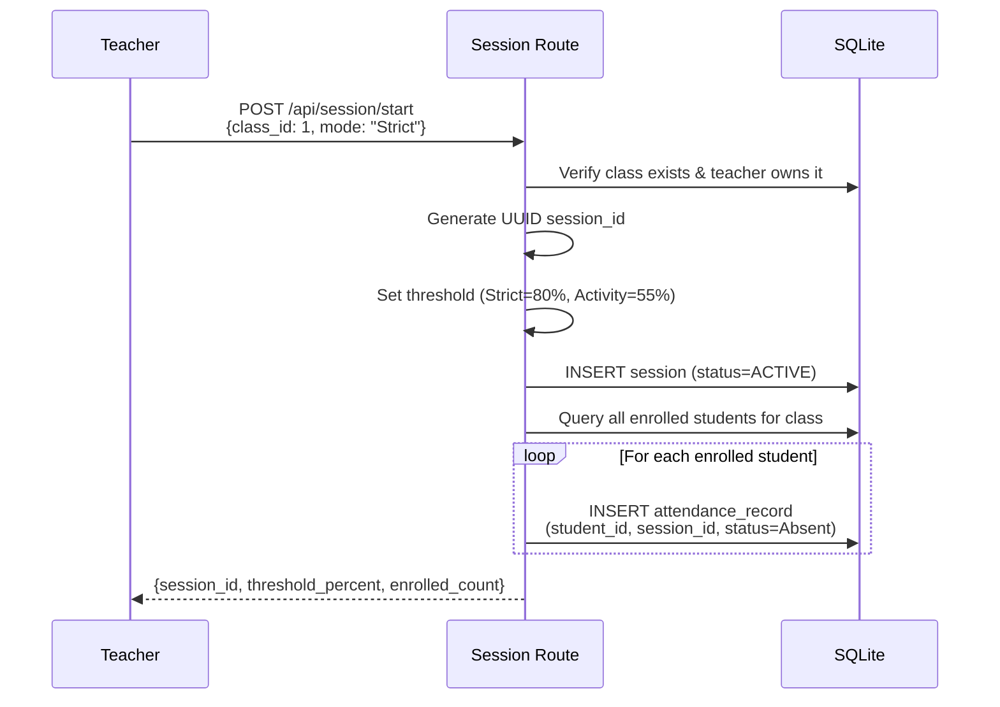

**What happens internally:**
1. Validates the teacher owns the class
2. Creates a UUID for the session
3. Sets the attendance threshold based on mode:
   - **Strict mode** → student must be present for **80%** of class duration
   - **Activity mode** → student must be present for **55%** of class duration
4. Creates an `attendance_record` for **every enrolled student** with `status=Absent` (default)

### 7.2 During a Session (Face Recognition — Not Yet Implemented)

> This is where the face recognition module will plug in later. It will:
> - Process camera frames
> - Identify students
> - INSERT `attendance_logs` with `event_type=ENTRY` or `EXIT` and a timestamp
>
> For now, you can manually insert attendance_logs for testing, or they'll remain empty.

### 7.3 Ending a Session

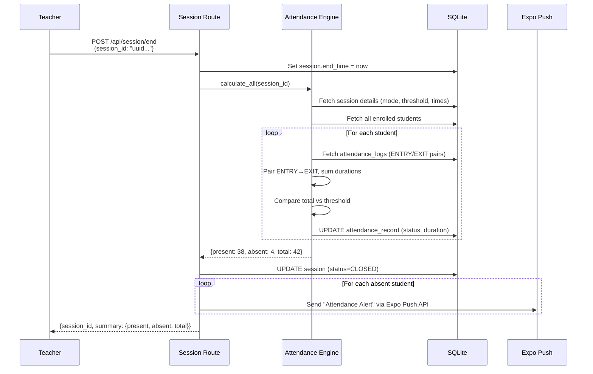

---

## 8. Attendance Calculation Engine

This is the brain of the system — `services/attendance_engine.py`.

### How Duration is Calculated

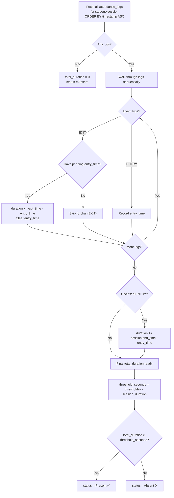

### Example Calculation

```
Session: 10:00 AM → 11:00 AM (60 min = 3600 sec)
Mode: Strict (threshold = 80% = 2880 sec)

Student logs:
  10:02 ENTRY
  10:30 EXIT    → 28 min = 1680 sec
  10:35 ENTRY
  11:00 EXIT    → 25 min = 1500 sec (closed by session end)

Total: 1680 + 1500 = 3180 sec
Threshold: 2880 sec
3180 ≥ 2880 → ✅ PRESENT
```

---

## 9. Excuse / Waiver Workflow

When a student is marked absent, they can submit an excuse. Admins review and approve/reject.

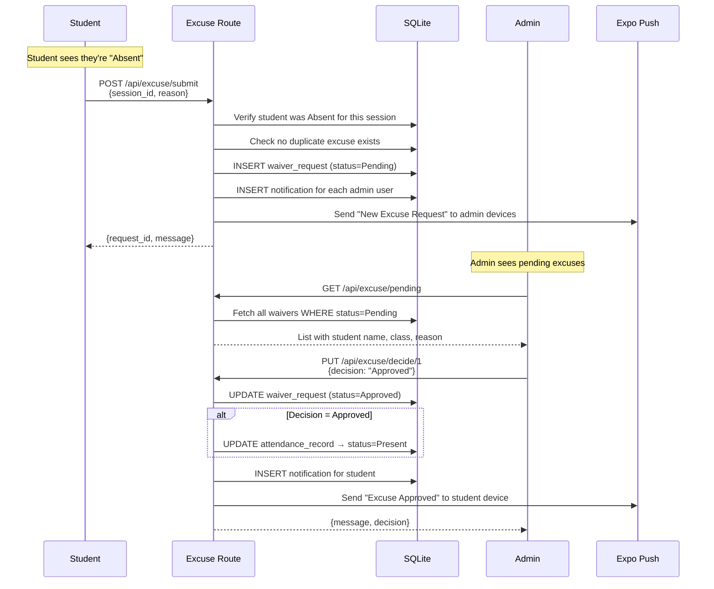

**Key rules:**
- Students can **only** submit excuses for sessions where they are `Absent`
- **One excuse per session** — duplicates return 409
- Approving an excuse **changes attendance to Present**
- Both student and admin get notifications at each step

---

## 10. Notifications System

Two notification channels work in parallel:

### In-App Notifications (SQLite `notifications` table)
- Stored in the database
- Retrieved via `GET /api/admin/notifications` or `GET /api/student/notifications`
- **Marked as read on fetch** — once you GET them, `is_read` flips to `true`

### Expo Push Notifications
- Sent to device via Expo push token stored on the user
- Real-time push to mobile devices
- **Best-effort** — if push fails, the API doesn't crash

| Event | Who Gets Notified | Notification Type |
|-------|-------------------|-------------------|
| Session ends, student absent | Student (Expo push + in-app) | "Attendance Alert" |
| Student submits excuse | All admins (Expo push + in-app) | "New Excuse Request" |
| Admin approves excuse | Student (Expo push + in-app) | "Excuse Approved" |
| Admin rejects excuse | Student (Expo push + in-app) | "Excuse Rejected" |

---

## 11. Complete Request Lifecycle

Here's what happens for **every single API request**, start to finish:

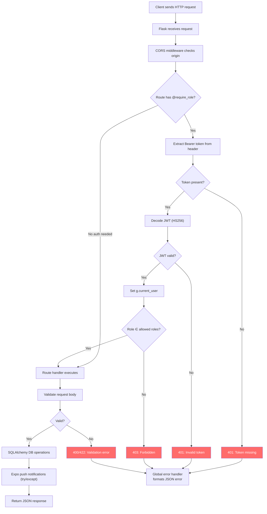

---

## 12. Entity Relationship Overview

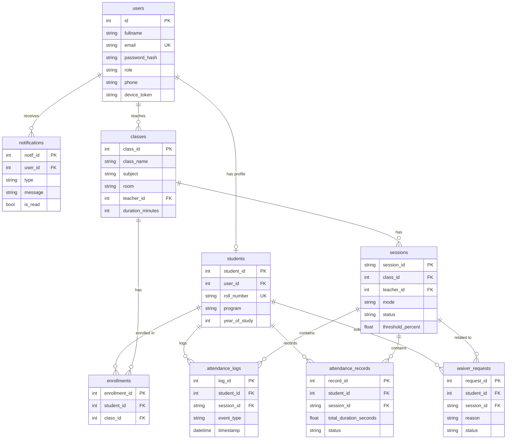

---

## Quick Reference — What Each Role Does First

| Step | Admin | Teacher | Student |
|------|-------|---------|---------|
| 1 | `python seed_admin.py` | — | — |
| 2 | Login → get token | — | — |
| 3 | Register teacher & students | — | — |
| 4 | Create classes | — | — |
| 5 | Enrol students in classes | — | — |
| 6 | — | Login → get token | — |
| 7 | — | Start session | — |
| 8 | — | End session | — |
| 9 | — | View reports | Login → get token |
| 10 | Review excuses | — | View attendance |
| 11 | Approve/reject excuses | — | Submit excuses |
## 14. Admin Panel Authentication Flow
The admin panel uses session-based authentication (cookies) via `Flask-Login`, which is separate from the JWT authentication used by the API routes. 
- When an admin attempts to access `/admin/`, `Flask-Login` checks if there's an active session.
- If unauthenticated, the user is redirected to `/admin/login`.
- The login form validates the user against the `User` table, using the same `bcrypt` password check as the API.
- Upon successful validation and role verification (`is_admin`), a session cookie is issued, granting access to the panel.

## 15. Admin Panel Request Lifecycle
Each request to an admin route (e.g., `/admin/user/`) follows this lifecycle:
1.  **Request Reception:** The request hits the Flask app.
2.  **CSRF Check:** `Flask-WTF` intercepts POST requests to validate the CSRF token.
3.  **Authentication/Authorization:** The `is_accessible()` method on the corresponding model view is triggered. This checks if the user is authenticated via `current_user.is_authenticated` and has the `admin` role via `is_admin(current_user)`.
4.  **Inaccessible Callback:** If `is_accessible()` fails, `inaccessible_callback()` intercepts and redirects the user to the login page.
5.  **View Execution:** If authorized, the `Flask-Admin` base view executes its standard CRUD logic (e.g., querying the DB, rendering templates).

## 16. Admin CRUD Workflow
The admin panel provides CRUD operations mapped to the SQLAlchemy models:
-   **Create:** A form is generated based on the model's columns. Relationships (like `teacher_id` in `Class`) are populated as dropdowns. Passwords for new users are hashed automatically via an `on_model_change` hook.
-   **Read (List & Detail):** Displays paginated records. Sensitive fields like `password_hash` are excluded. Search and filters are applied dynamically to the SQLAlchemy query.
-   **Update:** Similar to Create, utilizing an auto-generated form. Read-only fields are disabled.
-   **Delete:** Records can be deleted (subject to database constraints).

## 17. Admin Authorization Flow
Authorization in the admin panel is governed by custom base views:
-   `SecureModelView`: Provides full CRUD capabilities. It overrides `is_accessible()` to enforce `current_user.is_authenticated` and `is_admin(current_user)`.
-   `ReadOnlyAdminView`: Inherits from `SecureModelView` but disables create, edit, and delete actions. Used for system-generated logs like `AttendanceLog` and `Notification`.
-   `AdminOnlyView`: Used for non-model views like the custom Dashboard. Enforces the same `is_accessible` rules.

## 18. Admin Model Registration Flow
The `init_admin(app)` function in `admin/__init__.py` orchestrates the setup:
1.  Initializes `Flask-WTF` CSRF protection.
2.  Initializes `Flask-Login` for session management.
3.  Instantiates the `Flask-Admin` object with a custom `AdminIndexView` for the dashboard and login routing.
4.  Imports all SQLAlchemy models to prevent circular dependencies.
5.  Imports the customized model views (e.g., `UserAdmin`, `ClassAdmin`).
6.  Registers each view with the `Admin` instance via `admin.add_view()`.

## 19. Admin Database Interaction Flow
`Flask-Admin` integrates tightly with `SQLAlchemy`. The view classes (e.g., `UserAdmin`) are instantiated with the SQLAlchemy `db.session`. All CRUD operations initiated from the UI translate directly into SQLAlchemy commands executed within the context of the active request, ensuring data consistency with the main application. Hooks like `on_model_change` intercept the flow before `db.session.commit()` is called, allowing for custom logic (like hashing passwords or finalizing attendance when an excuse is approved).
